# NBA Scores System Diagram

## User Flow: Viewing Today's NBA Scores

```mermaid
flowchart TD
    subgraph User Actions
        A[👤 User Opens NBA App] --> B[📱 App Home Screen Loads]
        B --> C[👆 User Taps 'Scores']
        C --> D[📋 Scores Menu Appears]
        D --> E[👆 User Taps 'NBA']
    end

    subgraph Frontend
        E --> F[🔄 Scores Screen Renders]
        F --> G[📡 API Request Triggered]
    end

    subgraph Backend Services
        G --> H{API Gateway}
        H --> I[Authentication Service]
        I --> J[Scores Service]
        J --> K[(NBA Scores Database)]
        K --> L[Query Today's Games]
        L --> M[Format Response JSON]
    end

    subgraph Response Flow
        M --> N[📦 JSON Response]
        N --> O[Parse Game Data]
        O --> P[🏀 Render Score Cards]
    end

    P --> Q[👀 User Sees Today's Scores]

    style A fill:#4a90d9,color:#fff
    style Q fill:#2ecc71,color:#fff
    style K fill:#9b59b6,color:#fff
    style H fill:#e74c3c,color:#fff
```

## Sequence Diagram: API Request Lifecycle

## Component Architecture

```mermaid
graph TB
    subgraph Client Layer
        Mobile[📱 NBA Mobile App]
        Web[🌐 NBA.com]
    end

    subgraph API Layer
        Gateway[API Gateway]
        LB[Load Balancer]
    end

    subgraph Service Layer
        ScoresSvc[Scores Service]
        GamesSvc[Games Service]
        TeamsSvc[Teams Service]
        StatsSvc[Stats Service]
    end

    subgraph Data Layer
        Primary[(Primary DB)]
        Replica[(Read Replica)]
        Cache[(Redis Cache)]
    end

    subgraph External
        LiveFeed[🏟️ Live Game Feed]
    end

    Mobile --> LB
    Web --> LB
    LB --> Gateway
    Gateway --> ScoresSvc
    Gateway --> GamesSvc
    Gateway --> TeamsSvc
    Gateway --> StatsSvc
    
    ScoresSvc --> Cache
    ScoresSvc --> Replica
    GamesSvc --> Replica
    
    LiveFeed --> Primary
    Primary --> Replica

    style Mobile fill:#4a90d9,color:#fff
    style Web fill:#4a90d9,color:#fff
    style Gateway fill:#e74c3c,color:#fff
    style Cache fill:#f39c12,color:#fff
    style Primary fill:#9b59b6,color:#fff
```

## Data Flow Summary

| Step | Action | Component | Description |
|------|--------|-----------|-------------|
| 1 | Open App | Client | User launches NBA app |
| 2 | Tap Scores | Client | Navigate to scores section |
| 3 | Tap NBA | Client | Filter to NBA league |
| 4 | API Call | Frontend | `GET /api/v1/scores/nba` |
| 5 | Auth Check | API Gateway | Validate user session/token |
| 6 | Cache Lookup | Redis | Check for cached scores |
| 7 | DB Query | Scores Service | Fetch from database if cache miss |
| 8 | Response | API | Return JSON with game data |
| 9 | Render | Frontend | Display score cards to user |
